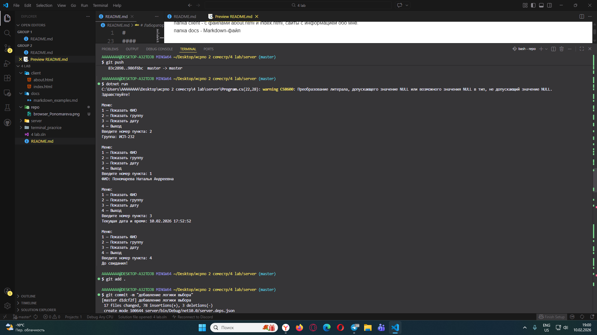
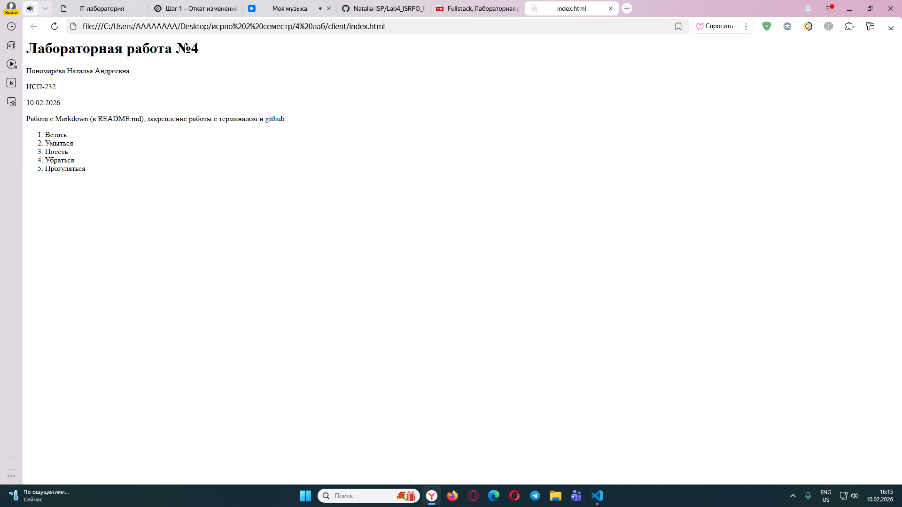
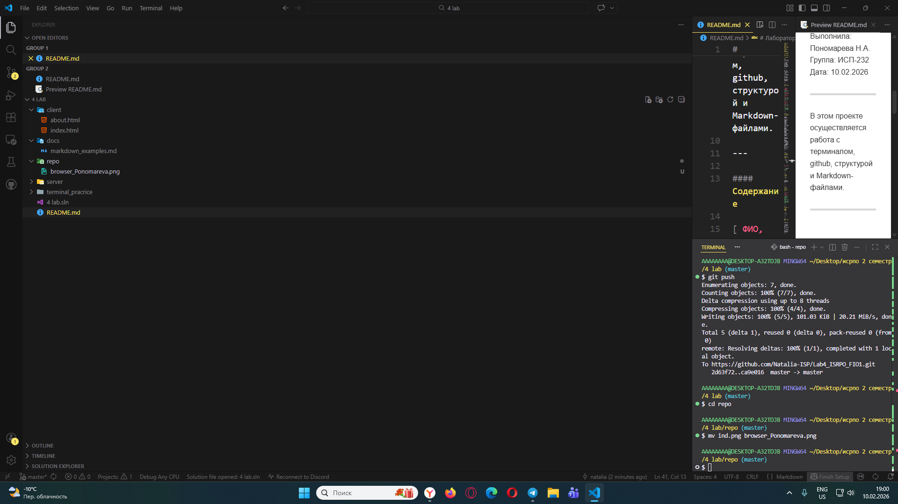
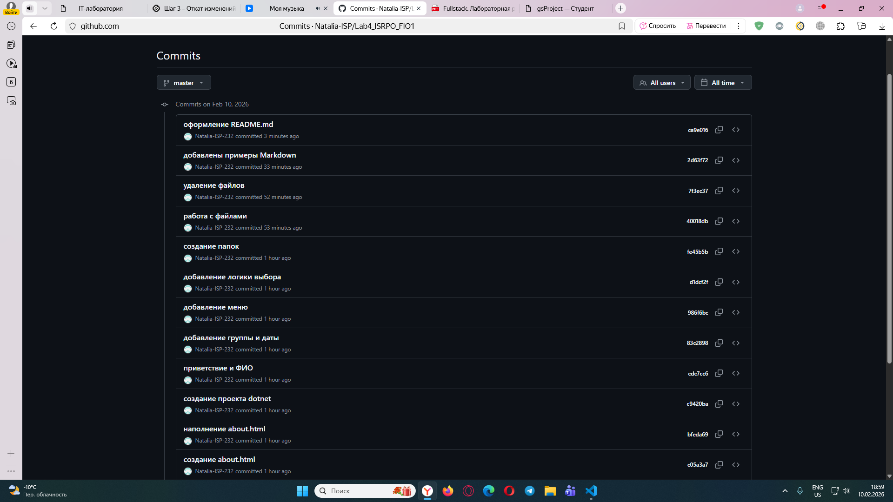

# Лабораторная работа №4. Закрепление навыков работы с Git, Markdown, терминалом и проектной структурой.
---
Выполнила: Пономарева Н.А.
Группа: ИСП-232
Дата: 10.02.2026

---

В этом проекте осуществляется работа с терминалом, github, структурой и Markdown-файлами.

---

#### Содержание

[ ФИО, группа, дата](#Выполнила:)
[Описание проекта](#9)
[Структура проекта](#Структура-проекта)
[Ссылка на репозиторий](#Ссылка)
[Скриншоты](#Скриншоты-из-папки-repo)

---

#### Структура проекта

папка client - c файлами about.html и index.html, сайты с информацией обо мне.
папка docs - Markdown-файл
папка repo - скриншоты
папка server - с файлами program.cs
папка terminal_pracrice - работа с файлами
README.md - документация проекта

---

#### Примеры Markdown

###### заголовок H6

+ пункт 1
    * пункт 2



```python
print("hi")
```
---

#### Пример LaTeX 

`text`

```
Console.ReadLine();
```

---

#### Ссылка на репозиторий

[Ссылка на репозиторий](https://github.com/Natalia-ISP/Lab4_ISRPO_Ponomareva)

---

#### Скриншоты из папки repo






---

#### Заключение

Научились оформлять README.md, поработали с терминалом и markdown-файлами.

---